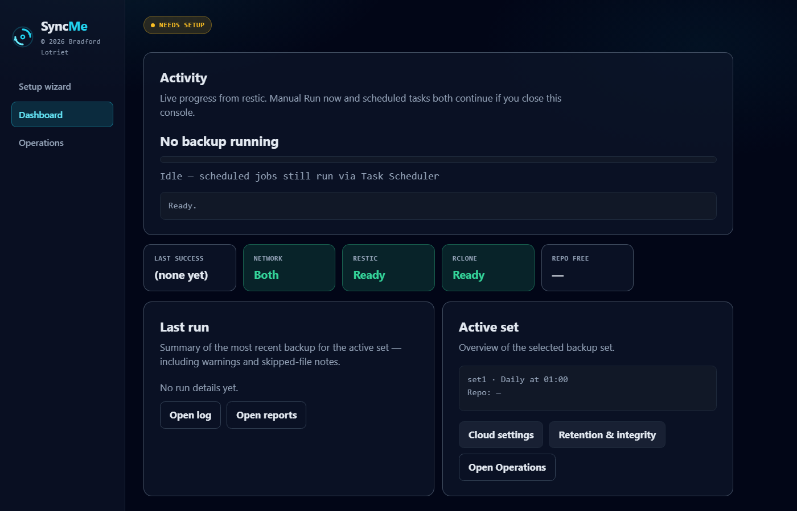
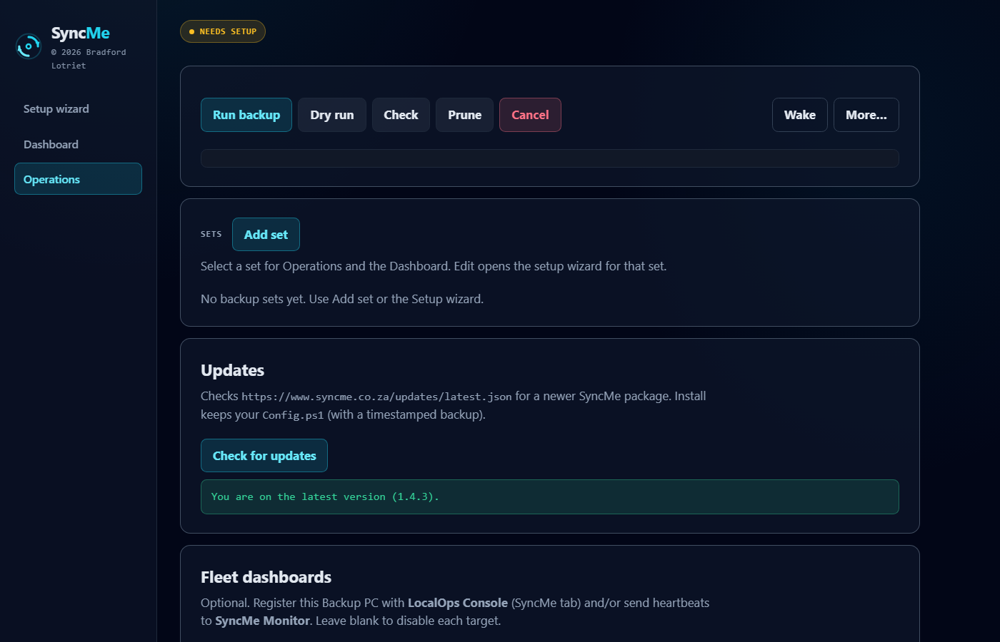
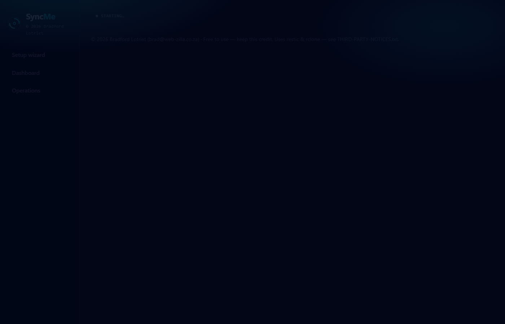
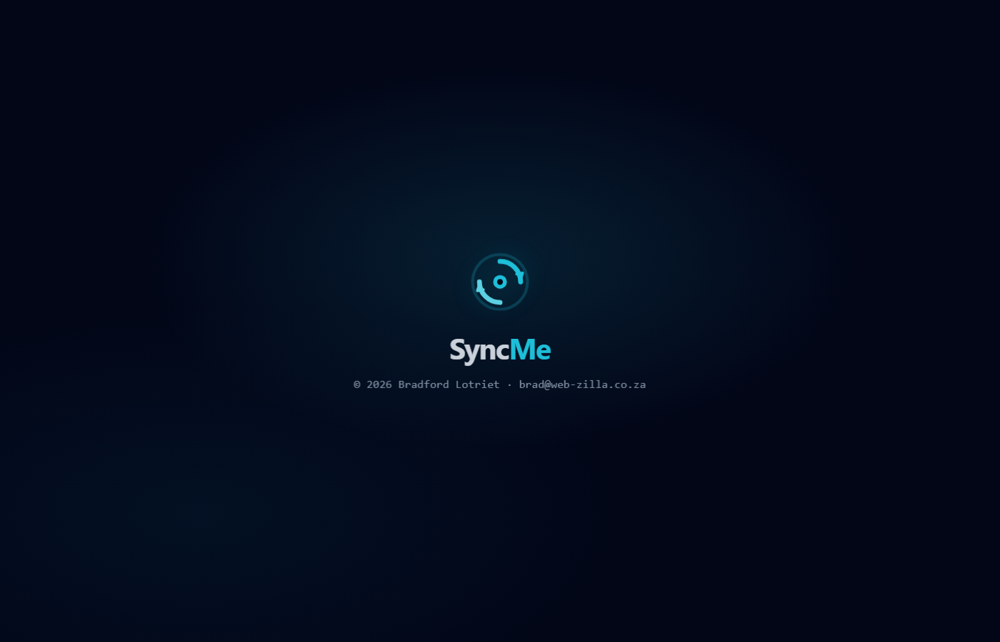

# SyncMe

**Website:** [www.syncme.co.za](https://www.syncme.co.za)  
**SyncMe** — Copyright © 2026 Bradford Lotriet (`brad@web-zilla.co.za`)

Free to use — keep this credit. See [`LICENSE.txt`](LICENSE.txt).

Simple **file-level** backup from source PCs to a Backup PC using **restic**, managed from an **HTML5 console**. Sources over **LAN and/or Tailscale**. Destinations: **local disk**, **NAS (UNC)**, or **cloud via rclone** (OneDrive / Google Drive OAuth). No PHP. No database.

**Not** bare-metal imaging, antivirus, or ransomware protection — **save the restic password in a password manager**, verify backups and restores, and keep separate recovery copies.

## Documentation & how-to

| Doc | Purpose |
|---|---|
| **[www.syncme.co.za](https://www.syncme.co.za)** | Product site, FAQ, User Guide |
| [`START-HERE.txt`](START-HERE.txt) | First steps after install / unzip |
| [`UserGuide.html`](UserGuide.html) | Full how-to: wizard, sets, restore, verify, Tailscale, troubleshooting |
| [`TECHNICAL.md`](TECHNICAL.md) | Complete technical architecture, pipelines, and API map |
| [`RecoveryChecklist.txt`](RecoveryChecklist.txt) | Disaster recovery + password vault checklist |
| [`LICENSE.txt`](LICENSE.txt) | Free-to-use terms and liability |
| [`THIRD-PARTY-NOTICES.txt`](THIRD-PARTY-NOTICES.txt) | restic / rclone licenses |

**Quick start**

1. Share source folder(s); ensure UNC reachability (LAN and/or Tailscale).
2. Unzip SyncMe on the **Backup PC** only. Open **`START-HERE.txt`**, then **`SyncMe.bat`**.
3. Complete the wizard (restic can be auto-installed). Pick network mode, folders, destination, schedule.
4. **Save the restic password** in a password manager or other safe place when the wizard creates it (Credential Manager alone is not enough if the Backup PC dies).
5. **Verify** before trusting the schedule: Run dry run → real backup → read Reports/Logs → Operations Check → restore to an empty test folder and spot-check critical paths against the source.
6. Use the dashboard for progress, schedule edits, restore, and **Add backup set**.

**Downloads / packages**

| Package | What it is |
|---|---|
| **`SyncMe-Setup-<ver>.zip`** | Backup PC console — wizard, backups, restore, schedule, HTTPS in-app updates. Unzip and run `SyncMe-Setup.cmd` (admin recommended on Windows Server). |
| **`SyncMe-Monitor-Setup-<ver>.zip`** | Optional **SyncMe Monitor** add-on — self-hosted fleet dashboard (see below). Separate install; not required for backups. |

Both zips (plus a short `START-HERE.txt`) are produced under `dist\SyncMe-Release-<ver>\`. Build:

```powershell
.\Build-SyncMeSetup.ps1          # SyncMe setup + Monitor package + SyncMe-Release-<ver>
.\Build-SyncMeMonitorSetup.ps1   # Monitor alone
.\Build-SyncMePackage.ps1        # full product tree zip
```

## Technology

| Layer | Tech |
|---|---|
| Host / API | PowerShell 5.1, `HttpListener` on `127.0.0.1:17845` (`SyncMe-Host.ps1`) |
| Backup engine | [restic](https://restic.net/) (encrypted, deduplicated snapshots) via `SyncMe-Backup.ps1` |
| Cloud backend | [rclone](https://rclone.org/) as restic remote only (OAuth for OneDrive / Google Drive) |
| Schedule | Windows Task Scheduler (+ SyncMe-Watchdog) |
| UI | Static HTML5 + CSS + vanilla JavaScript (`ui/`), dark slate + cyan ops theme (Segoe UI + Consolas) |
| Config / secrets | `Config.ps1` (no database); Windows Credential Manager; `Config\rclone.conf` |
| Optional | [Tailscale](https://tailscale.com/) (offsite SMB), OfficeAgent (VSS on source), SyncMe Monitor (fleet heartbeats), LocalOps Console (SyncMe tab registration) |
| Platform | Windows 10/11 or Windows Server (Backup PC) |

SyncMe is an **orchestration frontend** — not a replacement for restic or rclone. Third-party notices: [`THIRD-PARTY-NOTICES.txt`](THIRD-PARTY-NOTICES.txt).

## Features

| Feature | Notes |
|---|---|
| Multi backup sets | Switcher on dashboard/restore; add / edit (prefill) / delete |
| Multi-folder sets | Several UNC paths in one set |
| Network mode | LAN / Tailscale / Both |
| Destinations | Local, NAS UNC, rclone cloud (OAuth in console) |
| rclone bandwidth | `--bwlimit` + transfers/retries via env; restic upload limit |
| Retention & prune | Keep* editable in console; Prune now |
| Integrity check | Structural + weekly data subset; toggle in console |
| Restore | Browse snapshot folders/files in Operations, then restore latest/selected (optional include path) to an empty folder |
| Rescue Kit | Export printable HTML recovery sheet (no password) from Operations |
| Append-only policy | Optional: skip prune and block snapshot delete |
| Pre/Post hooks | Optional NonInteractive scripts around backup |
| Restore drill | Advisory: dumps up to 3 random files during weekly data check (PASS/FAIL/SKIP in report; does not fail the job) |
| Live progress + cancel | restic JSON %; cancel from console (with warning) |
| Schedule | Once / Daily / Weekly with start (and optional end) date → Task Scheduler |
| Wake-on-LAN | Optional MAC per set before backup / Wake button |
| Shadow copies | OfficeAgent scripts on source PC |
| Detached Run now | Manual backup survives closing SyncMe |
| In-app updates | HTTPS feed (`latest.json`), SHA-256 verify, keeps existing `Config.ps1` |
| SyncMe Monitor | Optional self-hosted fleet dashboard via post-backup (and Save) heartbeats |
| LocalOps Console | Optional: when LocalOps runs on the same PC, SyncMe registers so the SyncMe tab finds the install + last run |

## SyncMe Monitor (optional add-on)

**What it is:** a small, self-hosted Windows package that shows which Backup PCs last reported a backup — success, failure, stale, or running. It is **not** installed on a public web server. Run it on a PC on your **LAN or Tailscale** network. Read-only in this release (no remote start/stop/restore). No restic passwords are sent.

**What it is not:** a replacement for SyncMe, restic, or email reports. Backups still run only on each Backup PC. Monitor only receives lightweight status heartbeats.

**How it works**

1. Unzip **`SyncMe-Monitor-Setup-<ver>.zip`** on the Monitor PC. Edit `Config\Monitor.json` — set a shared `Token` (not `change-me`) and `Port` (default **17846**).
2. Run **`SyncMe-Monitor.bat`** (Run as Administrator once if binding to `http://+:port` fails). Open `http://127.0.0.1:17846/` (or `http://THIS-PC:17846/` from another machine).
3. On each **Backup PC**, SyncMe console → **Operations** → **Fleet dashboards** → SyncMe Monitor:
   - **Monitor URL** — e.g. `http://MONITOR-PC:17846` (same PC: `http://127.0.0.1:17846`)
   - **Site id** — friendly name for that Backup PC
   - **Shared token** — same value as `Monitor.json`
   - Click **Save fleet settings** — SyncMe sends a **test heartbeat** immediately so the site should appear on the dashboard.
4. After each backup finishes, SyncMe also POSTs a heartbeat (Bearer token). The Monitor UI refreshes on a short interval.

Keep Monitor off the public internet. Heartbeat ingest requires the shared token.

## LocalOps Console (optional sibling)

**LocalOps Console** is a separate ops tool (sibling folder `LocalOpsConsole`). When both run on the Backup PC:

1. Start LocalOps (`http://127.0.0.1:8787`).
2. In SyncMe → **Operations** → **Fleet dashboards** → LocalOps Console: leave URL blank (defaults to localhost:8787) and keep registration enabled, then **Save**.
3. SyncMe POSTs `/api/v1/syncme/register` (loopback) with install path + optional last-run summary so the LocalOps **SyncMe** tab can open the console / start backup without manually setting `syncMePath`.

Registration is non-fatal: if LocalOps is not running, backups still succeed. Monitor and LocalOps can both be enabled.

## Screenshots

Screenshots for GitHub / the marketing site live under [`docs/screenshots/`](docs/screenshots/) (add PNGs after a theme pass: splash, dashboard, operations, Monitor, LocalOps SyncMe tab).









## Secrets

Windows Credential Manager: `SyncMeRestic` / `SyncMeRestic-<setId>`, `SyncMeSmtp`, optional `SyncMeShare` / `SyncMeShare-<setId>`.
rclone OAuth tokens live in `Config\rclone.conf` (not in git).

**Restic password:** encrypts the repository. Without it there is no restore or recovery. Keep a copy in a password manager or other safe place — do not put it in `Config.ps1`.

## Verify backups and restores

1. After Apply, **Run dry run**, then a real backup.
2. Open **Reports** / **Logs** (restic exit **3** = some files unread — often locked Office files).
3. Operations **Check** (structural + weekly data subset) for repository health.
4. Restore into an **empty test folder** and compare critical paths to the source.

## Destinations

- **restic repository** (required per set): full path on *this* Backup PC, NAS UNC, or `rclone:remote:path`.
- Use **Add backup set** for another source PC / schedule / destination.
- Config defaults ship empty so you can run SyncMe on any server without baked-in drive letters.

Sources are UNC (LAN or Tailscale), including admin shares such as `\\pc-name\C$\Users\…`.

## How it works

```
SyncMe.bat → SyncMe-Host.ps1 (localhost) → HTML UI
                              ↓
              restic + SyncMe-Backup.ps1 -SetId … + Task Scheduler
```

## Cloud (OneDrive / Google Drive)

1. Prerequisites → **Install rclone** (or use PATH).
2. Dashboard **Cloud settings** (modal) or wizard destination → **Add OneDrive / Add Google Drive** (browser OAuth; 5-minute timeout).
3. Pick remote + folder path → **Save cloud dest**. Destination becomes `rclone:remote:path`.
4. After setup apply, use **Run dry run** to verify before relying on the schedule.
5. Set bandwidth (e.g. `2M`) and retries to limit OneDrive uploads.

Sync/Bisync folder mirroring is planned later — this release uses rclone only as the restic cloud backend.

Consumer clouds may throttle large backups — prefer local disk or NAS for the primary repository when possible.

## Restore

**Operations** → refresh snapshots → select a snapshot → **Browse selected** to walk folders inside that snapshot (one level at a time). Use **Use this path** to fill the optional include field (one file or folder), or leave include blank for a full snapshot.

Then **Restore latest** or **Restore selected** into an empty folder outside the live repository (Suggest helps). Windows does not support restic mount; browse + restore replaces that.

If the repository password is missing, use **Store password** on Operations (or Edit set → Passwords).

Data added on later runs can be tiny (KB) even when Total bytes processed is large — restic deduplicates against existing snapshots.

### Versioning

Current release: **1.4.3**. `VERSION.txt` uses semantic versioning. Customer packages: `dist\SyncMe-Release-<version>\` (SyncMe setup + Monitor zips).

**1.4.3** dark slate + cyan ops theme (console, Monitor, reports, user guide), LocalOps Console SyncMe-tab registration (loopback-only), Fleet dashboards UI (LocalOps + Monitor), Monitor DOM-safe rendering, SECURITY.md LocalOps notes.

**1.4.2** solidifies the 1.4 line: ASCII-safe scripts/batch (no UTF-8 BOM on `.bat`/`.cmd`), Monitor test heartbeat on Save, Monitor UI refresh, combined `SyncMe-Release-1.4.2` hand-off, and PowerShell 5.1-safe source (no UTF-8 arrows misread as ANSI).

**1.4.1** fixes setup/update folder merge (no nested `ui\ui` / `Modules\Modules`), makes Check for updates a primary action, and ships InstallMerge helpers for reliable upgrades.

**1.4.0** adds in-app updates (HTTPS feed at `www.syncme.co.za/updates/latest.json`, SHA-256 verify, Config.ps1 backup+preserve) and an optional self-hosted **SyncMe Monitor** add-on (heartbeat fleet dashboard).

**1.3.3** fixes snapshot folder browse: converts Windows paths to restic-absolute `/C/...` form before `restic ls` (and restore `--include`), so double-clicking a browsed folder no longer fails with “path filters must be absolute”.

**1.3.2** enables TLS 1.2 for SMTP email, keeps full certificate validation (no bypass), clears Host/SMTP notify noise from failing backup reports, and improves email failure logging.

**1.3.1** makes the weekly restore drill advisory (report PASS/FAIL/SKIP only; never fails the overall job), verifies with `restic dump` plus retries, and soft-skips when no snapshots/files exist. Official setup zips still do not bundle restic/rclone (install from the console).

**1.3.0** adds Rescue Kit export, append-only policy (skip prune / block deletes), stale lock auto-unlock, pre/post backup script hooks, and weekly restore drills.

**1.2.0** fixes snapshot browse on Windows PowerShell 5.1 (`Argument types do not match` when opening a snapshot’s root folders).

### Console layout

- **Setup wizard** — configure sets (including schedule and optional dry run at the end).
- **Dashboard** — status cards (restic/rclone/disk), live activity, last-run details, Cloud & Retention modals; update popup when a newer package is published.
- **Operations** — backup actions, set list (edit/delete), snapshot browse and restore, Check for updates, Fleet dashboards (LocalOps Console + SyncMe Monitor).

## Prerequisites

- Windows 10/11 or Windows Server Backup PC
- Source SMB share(s) reachable as UNC (LAN and/or [Tailscale](https://tailscale.com/))
- [restic](https://restic.net/) (wizard can install into `tools\`)
- Optional: rclone (console can install) for cloud destinations
- Optional: Tailscale for offsite UNC; OfficeAgent for locked files on the source
- Optional: SyncMe Monitor package on a LAN/Tailscale PC for a fleet status dashboard

## Links

- Product site: [www.syncme.co.za](https://www.syncme.co.za)
- Roadmap: [www.syncme.co.za/roadmap.html](https://www.syncme.co.za/roadmap.html)
- In-app update feed: [www.syncme.co.za/updates/latest.json](https://www.syncme.co.za/updates/latest.json)
- Contact: brad@web-zilla.co.za
