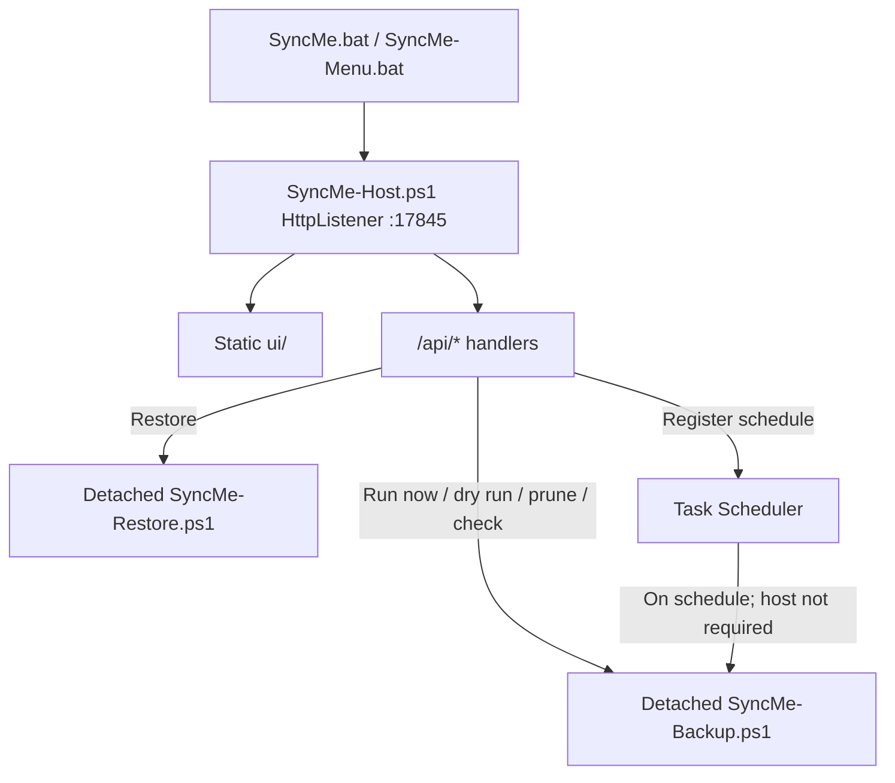
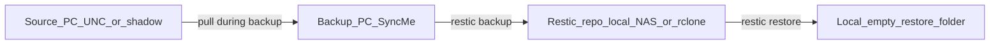

# SyncMe — Technical Breakdown

**Version:** 1.4.2 (see [`VERSION.txt`](VERSION.txt))  
**Website:** [www.syncme.co.za](https://www.syncme.co.za)  
**Copyright © 2026 Bradford Lotriet** (`brad@web-zilla.co.za`)

This document describes how SyncMe is built, how it runs, and what it offers. For operator steps see [`UserGuide.html`](UserGuide.html) and [`START-HERE.txt`](START-HERE.txt). For a short product overview see [`README.md`](README.md).

---

## 1. Purpose

### What it is

SyncMe is a **Windows Backup PC orchestration layer** around [restic](https://restic.net/):

- **File-level** backup from source PCs (UNC over LAN and/or [Tailscale](https://tailscale.com/)) into encrypted, deduplicated **restic repositories**.
- Managed from a local **HTML5 console** (no PHP, no database).
- Destinations: **local disk**, **NAS (UNC)**, or **cloud via rclone** as a restic remote (`rclone:remote:path` — OneDrive / Google Drive OAuth).
- **Multi backup-set** model (per source / schedule / destination).
- Optional **OfficeAgent** on source PCs for Volume Shadow Copy–based pulls of open files.
- Optional email alerts, Task Scheduler registration, and a watchdog for overdue successes.

### What it is not

- Bare-metal imaging, antivirus, or ransomware protection.
- A replacement for restic or rclone (it shells out to them).
- A LAN-facing multi-user web server (binds **localhost only**).
- rclone folder **sync/bisync** mirroring (cloud is restic-backend only; sync is planned later).
- Windows restic **mount** / FUSE browse-as-drive (browse API + restore instead).

### Stack

| Layer | Technology |
|---|---|
| Host / API | Windows PowerShell 5.1, `HttpListener` on `127.0.0.1:17845` |
| Backup engine | restic via `SyncMe-Backup.ps1` |
| Cloud backend | rclone as restic remote only |
| Schedule | Windows Task Scheduler (+ optional SyncMe-Watchdog) |
| UI | Static HTML5 + CSS + vanilla JS (`ui/`) |
| Config / secrets | `Config.ps1`; Windows Credential Manager; `Config\rclone.conf` |
| Platform | Windows 10/11 or Windows Server (Backup PC only) |

---

## 2. Repository layout

| Path | Role |
|---|---|
| `SyncMe.bat` | Primary launcher → host on port 17845 |
| `SyncMe-Menu.bat` | Same host, opens console view (`?view=console`) |
| `SyncMe-Host.ps1` | HttpListener API + static UI server |
| `SyncMe-Backup.ps1` | Backup engine (backup / prune / archive / check) |
| `SyncMe-Restore.ps1` | Detached restore runner (status JSON) |
| `SyncMe-Watchdog.ps1` | Overdue last-success → CRITICAL email |
| `Register-BackupTask.ps1` | Task Scheduler registration |
| `Config.ps1` | On-disk set config (wizard-generated or legacy) |
| `Build-SyncMeSetup.ps1` | Minimal customer setup folder under `dist\` |
| `Build-SyncMePackage.ps1` | Full zip package under `dist\` |
| `Deploy-SyncMe.ps1` | Technician deploy to `C:\SyncMe` (preserves Config) |
| `VERSION.txt` | Semver for packages and reports |
| `Modules/` | Shared PowerShell: Common, Sets, Notify, Report, Restore |
| `ui/` | Console: `index.html`, `css/`, `js/app.js` (+ design `mockups/`) |
| `OfficeAgent/` | Source-PC shadow-copy scripts + README |
| `tools/` | Portable `restic.exe`, `rclone.exe` when installed by console |
| `Config/` | Runtime `rclone.conf` (OAuth tokens; not for git) |
| `Logs/`, `Reports/` | Runtime artifacts (per-set under `Logs\sets\<id>\`) |
| `website/` | Marketing site (www.syncme.co.za); kept local / deployed separately; **not** in the public git tree; **excluded** from customer packages |
| `dist/` | Build outputs (typically gitignored) |
| `TECHNICAL.md` | This document |
| `README.md`, `UserGuide.html`, `START-HERE.txt`, `RecoveryChecklist.txt` | Product / ops docs |
| `LICENSE.txt`, `THIRD-PARTY-NOTICES.txt` | License and restic/rclone notices |

---

## 3. Runtime architecture

### Process model

1. **`SyncMe.bat`** starts `SyncMe-Host.ps1 -Port 17845 -OpenView auto` and opens the browser. Closing the console window **stops the host**.
2. The host serves static files from `ui/` and JSON APIs under `/api/*`.
3. **Scheduled backups do not need the host**: Task Scheduler runs `SyncMe-Backup.ps1 -SetId …` directly.
4. Console **Run now** / dry run / prune / check / restore spawn a **detached hidden** `powershell.exe` so jobs can outlive closing the SyncMe window.
5. Progress for a set lives in `Logs\sets\<setId>\live-progress.json` (plus a lock file / PID). The host polls these for dashboard status.
6. Only one host can bind the port; per-set `backup.lock` prevents overlapping backups for the same set.

### Data path (conceptual)

---

## 4. What SyncMe offers

| Feature | Notes |
|---|---|
| Multi backup sets | Switcher on dashboard/operations; add / edit / delete |
| Multi-folder sets | Several UNC (or local) paths in one set |
| Network mode | `lan` / `tailscale` / `both` |
| Destinations | Local folder, NAS UNC, or `rclone:remote:path` |
| Cloud OAuth | Add OneDrive / Google Drive from wizard or Cloud settings |
| rclone bandwidth | `RCLONE_BWLIMIT`, transfers/retries; optional restic upload limit |
| Retention & prune | KeepLast / Daily / Weekly / Monthly; Prune now |
| Integrity check | Structural `restic check`; optional weekly data subset + advisory restore drill (`restic dump`, does not fail the job) |
| Snapshot browse | Lazy one-level listing in Operations (no Windows mount) |
| Restore | Latest or selected snapshot; optional include path; Suggest target |
| Rescue Kit | Printable HTML export (repo paths, credential target, recovery steps — no password) |
| Append-only | SyncMe policy: skip prune / block deletes (optional true restic append-only keys separately) |
| Pre/Post scripts | NonInteractive timed hooks around backup |
| Dry run | What-if backup without committing |
| Live progress + cancel | restic JSON %; cancel with warning |
| Schedule | Once / Daily / Weekly → Task Scheduler |
| Wake-on-LAN | Optional MAC per set before backup |
| Shadow copies | OfficeAgent on source; pointer file for `@GMT-…` paths |
| Detached Run now | Manual backup survives closing SyncMe |
| Reports | HTML under `Reports\`; last-run JSON under `Logs\sets\` |
| Notifications | Optional toast; preferred email (SMTP + Credential Manager) |
| Watchdog | Daily check of last-success stamp → CRITICAL email if stale |
| Prerequisites | Install restic / rclone into `tools\` from the console |

---

## 5. Backup pipeline

**Entry:** [`SyncMe-Backup.ps1`](SyncMe-Backup.ps1)  
**Switches (high level):** `-SetId`, `-WhatIf`, `-SkipArchive`, `-ForceArchive`, `-SkipPrune`, `-SkipCheck`, `-CheckOnly`, `-PruneOnly`, `-RunDataCheck`, `-NoNotify`.

### Ordered flow (normal run)

1. Load set from `Config.ps1` via [`Modules/Sets.ps1`](Modules/Sets.ps1).
2. Optional **Wake-on-LAN** + short wait.
3. Acquire **run lock** under `Logs\sets\<setId>\`; exit cleanly if another instance holds it.
4. Resolve restic (`tools\restic.exe` / PATH / `ResticPath`); initialize **rclone environment** when the repo is `rclone:…`.
5. Free-space gate on the repository path (**skipped** for `rclone:`).
6. Load restic password from Credential Manager (`ResticCredentialName`).
7. **NetworkMode**:
   - `lan` or sources that look local (non-UNC) → skip Tailscale hard-fail.
   - `tailscale` → fail if Tailscale is unhealthy.
   - `both` → advisory only when Tailscale is down.
8. Optional SMB map (`ShareCredentialName` / temporary drive letter).
9. Preflight: optional `SourceHost` reachability + configured `SourcePaths` (`RequireSourceReachable`).
10. **Resolve sources** (`Resolve-BackupSourcePaths`):
    - Prefer shadow `@GMT-…` via pointer `.syncme-latest-shadow.txt` (legacy `.monarch-latest-shadow.txt`) under the share root (OfficeAgent).
    - Else live UNC; `ShadowCopyRequired` can force failure if shadow is missing.
11. **Rewrite UNC → temporary drive letters** so Windows restic stores restorable path nodes (not UNC roots).
12. Start toast/email “running” notification when enabled.
13. **`restic backup --json`** (tags, excludes, optional `--limit-upload`, `--host`).
    - Exit **0** — success.
    - Exit **3** — some files unread (often locked Office on a live share); treat as **WARN**, continue with usable snapshot when summary exists.
    - Other non-zero — fail (with summary/exit hardening so blank exit does not falsely report SUCCESS without evidence).
14. **`restic forget --prune`** with Keep* policies when backup succeeded and prune not skipped.
15. **Optional Disk 2 archive** (legacy): if `ArchivePath` is set and due (`ArchiveEveryDays`), optionally clear target and `restic restore latest` to plain files. Empty `ArchivePath` → skip (normal for cloud / single-disk setups).
16. **Repo check:** structural `restic check`; on configured weekday (default Sunday) or `-RunDataCheck`, `--read-data-subset=n/7`.
17. Write HTML report ([`Modules/Report.ps1`](Modules/Report.ps1)), update last-success stamp / last-run JSON, complete notifications, mark live-progress done/error.

### Task Scheduler and watchdog

- [`Register-BackupTask.ps1`](Register-BackupTask.ps1) creates `SyncMe-Backup` or `SyncMe-Backup-<setId>` (Once / Daily / Weekly). Default logon mode supports **run whether user is logged on**; task limit and IgnoreNew for overlaps.
- Optional **SyncMe-Watchdog** daily task runs [`SyncMe-Watchdog.ps1`](SyncMe-Watchdog.ps1), which checks each set’s `Logs\sets\<id>\last-success-utc.txt` (default max age ~2 days, overridable) and emails CRITICAL via an email-enabled set’s SMTP settings.

---

## 6. Restore and snapshot browse

| Concern | Behavior |
|---|---|
| List snapshots | `GET /api/snapshots` → `Get-SyncMeSnapshots` in [`Modules/Restore.ps1`](Modules/Restore.ps1) |
| Browse one level | `GET /api/snapshot/ls` → `Get-SyncMeSnapshotListing` (empty path = snapshot root `Paths` as folders; then lazy children via `restic ls --json`) |
| Restore | `POST /api/restore` → detached [`SyncMe-Restore.ps1`](SyncMe-Restore.ps1) → `Invoke-SyncMeRestore` |
| Status / cancel | `/api/restore/status`, `/api/restore/cancel` |
| Target safety | Empty-ish folder **outside** the live restic repo; Suggest builds under archive/repo drive → `SyncMe-Restore\…` or project `Restores\` |
| Include | Optional restic `--include` for one file/folder |

### Constraints

- Official Windows restic has **no mount**; mount APIs throw / are stubs.
- Snapshots that still store **UNC path nodes** cannot be browsed or restored cleanly on Windows — take a new backup after drive-letter rewrite, then use that snapshot.
- Browse/restore is blocked while a backup holds the repository lock.
- Restore **target cannot be** `rclone:`; cloud repos are read by restic, files land on a local path.

**Browse implementation note (1.2.0):** entry lists use plain PowerShell arrays. On Windows PowerShell 5.1, wrapping `List[object]` of PSCustomObjects with `@(...)` throws `Argument types do not match`.

---

## 7. Configuration and secrets

### Config.ps1

- Wizard / APIs write multi-set config via `Write-SyncMeSetsConfigFile`: `$script:BackupSets = @(…)`, `$script:BackupConfig = $BackupSets[0]`, helpers `Get-BackupConfig` / `Get-BackupSets`.
- Legacy single `$BackupConfig` remains readable through set-loading helpers.
- Defaults and merge live in `ConvertTo-SyncMeSetObject` ([`Modules/Sets.ps1`](Modules/Sets.ps1)): NetworkMode, DestinationType, schedule fields, rclone knobs, Keep*, WoL, shadow flags, etc.
- Rewrites keep timestamped backups: `Config.ps1.bak-<timestamp>`.

### Per-set runtime files

Under `Logs\sets\<setId>\`:

- `last-success-utc.txt`
- `backup.lock`
- `live-progress.json`
- `last-run.json`
- `restore-status.json` (when restoring)

### Credential Manager (Generic)

| Target | Purpose |
|---|---|
| `SyncMeRestic` / `SyncMeRestic-<setId>` | Restic repository password (`set1` commonly uses the unscoped name) |
| `SyncMeShare` / `SyncMeShare-<setId>` | Optional SMB credentials |
| `SyncMeSmtp` | SMTP password |

Passwords are **never** stored in `Config.ps1`. The Windows account that runs scheduled tasks must be the same account that owns these secrets.

### rclone secrets

OAuth tokens live in `Config\rclone.conf` (created/updated by console authorize flows). Do not commit this file.

---

## 8. Cloud (rclone)

### Connect from the console

1. Prerequisites → **Install rclone** (optional if already on PATH / `tools\`).
2. Wizard destination **Cloud (rclone)** or Dashboard **Cloud settings**.
3. **Add OneDrive** / **Add Google Drive** → browser OAuth (~**5-minute** timeout).
4. Pick remote + folder → **Save cloud dest** → `ResticRepo = rclone:remote:path` (e.g. `rclone:onedrive:SyncMe/set1`).

### Push

Scheduled or manual backup runs restic against the cloud-backed repo. SyncMe sets `RCLONE_CONFIG` and optional bandwidth/transfers/retries from set fields. That is the **upload / push** of encrypted repository objects — not a plain folder sync.

### Pull / recover

- **No** rclone bisync or mirror job.
- Recover with **restic restore** from the cloud repo to a **local** empty folder (browse + restore in Operations).

### Practical notes

- Prefer local disk or NAS as primary when possible; consumer clouds throttle large repos.
- Each set needs its **own** restic repo subfolder (never the cloud drive root).
- Keep the **restic password** offline; cloud login alone cannot decrypt data.

---

## 9. HTTP API map

All APIs are served by [`SyncMe-Host.ps1`](SyncMe-Host.ps1) on `http://127.0.0.1:17845`.

### Status and prerequisites

| Method | Path | Role |
|---|---|---|
| GET | `/api/status` | Version, configured, sets, disk, Tailscale, last run, backup running |
| GET | `/api/prereqs` | Tool presence |
| POST | `/api/prereqs/install-restic` | Install restic into `tools\` |
| POST | `/api/prereqs/install-rclone` | Install rclone into `tools\` |
| POST | `/api/prereqs/install-winfsp` | WinFsp helper (mount-related; mount still unavailable on Windows restic) |
| POST | `/api/test-source` | Probe source reachability |

### Setup, schedule, sets

| Method | Path | Role |
|---|---|---|
| POST | `/api/setup/apply` | Persist wizard / set configuration |
| POST | `/api/schedule` | Register / update Task Scheduler |
| GET | `/api/set` | Read set(s) |
| POST | `/api/set/delete` | Delete a set |
| POST | `/api/set/policy` | Retention / check toggles |
| POST | `/api/set/restic-path` | Configure restic executable path |
| POST | `/api/set/restic-password` | Store restic password in Credential Manager |
| POST | `/api/set/rclone` | Save cloud destination + rclone knobs |

### Backup

| Method | Path | Role |
|---|---|---|
| POST | `/api/backup` | Modes: run / whatIf / checkOnly / dataCheck / pruneOnly / forceArchive |
| GET | `/api/backup/status` | Running / progress payload |
| POST | `/api/backup/cancel` | Cancel running backup job |
| POST | `/api/wake` | Wake-on-LAN for a set |

### Snapshots and restore

| Method | Path | Role |
|---|---|---|
| GET | `/api/snapshots` | List snapshots for a set |
| GET | `/api/snapshot/ls` | Lazy directory listing inside a snapshot |
| POST | `/api/snapshot/delete` | Delete snapshot(s) |
| POST | `/api/restore` | Start restore job |
| GET | `/api/restore/status` | Restore progress |
| POST | `/api/restore/cancel` | Cancel restore |

### rclone

| Method | Path | Role |
|---|---|---|
| GET | `/api/rclone/status` | Remotes + rclone present |
| POST | `/api/rclone/authorize` | Start OAuth (`onedrive` / `drive`) |
| GET | `/api/rclone/authorize` | Poll OAuth status / URL |
| POST | `/api/rclone/authorize/cancel` | Cancel OAuth |
| GET | `/api/rclone/ls` | List directories on remote |
| POST | `/api/rclone/test` | Probe remote |

### Mount (disabled on Windows)

| Method | Path | Role |
|---|---|---|
| GET | `/api/mount/status` | Status stub |
| POST | `/api/mount/start` | Throws / not available |
| POST | `/api/mount/stop` | Stop stub |

### Misc

| Method | Path | Role |
|---|---|---|
| GET | `/api/update/check` | Compare local version to HTTPS `latest.json` feed |
| POST | `/api/update/install` | Download, SHA-256 verify, apply update (preserves Config) |
| GET/POST | `/api/options` | Update feed URL + Monitor heartbeat settings (`Config\SyncMeOptions.json`) |
| POST | `/api/open` | Open Explorer / editor for logs or reports |
| POST | `/api/shutdown` | Stop the host |
| GET | `/`, `/ui/*` | Static UI |

---

## 10. Packaging and deploy

| Script | Output / behavior |
|---|---|
| `Build-SyncMeSetup.ps1` | `dist\SyncMe-Setup-<VERSION>\` with `SyncMe-Setup.cmd` + `SyncMe-Payload.zip` (+ START-HERE). Unpacks to `C:\SyncMe`, keeps existing `Config.ps1`, merges folder contents (avoids nested `Modules\Modules`). Builds Monitor package, stages `dist\updates\latest.json` + setup zip (and Monitor zip when `website/` exists), and assembles `dist\SyncMe-Release-<VERSION>\` with both customer zips. Does **not** ship `website/` in the product payload. |
| `Build-SyncMeMonitorSetup.ps1` | Optional add-on: `dist\SyncMe-Monitor-Setup-<ver>\` (+ zip). Self-hosted fleet dashboard (HttpListener, default port 17846). |
| `Build-SyncMePackage.ps1` | Full zip `dist\SyncMe-<VERSION>.zip` (same product include list). |
| `Deploy-SyncMe.ps1` | Copy project → target (default `C:\SyncMe`); preserve Config and set JSON under Logs; stop running host; copy `tools\` binaries. |
| `VERSION.txt` | Semver; must match setup folder naming (`SyncMe-Setup-1.4.2`). Monitor uses `Monitor\VERSION.txt` (aligned to the same line). |

**Typical shipped include list:** bats, host/backup/restore/watchdog, Register/Deploy, Config template, docs (including this file), Modules, ui, OfficeAgent, tools — not `website/`, not customer log/report contents beyond placeholders.

---

## 11. OfficeAgent (source PC)

Scripts under [`OfficeAgent/`](OfficeAgent/) run on the **source** machine to enable shadow copies and write a pointer file (e.g. `.syncme-latest-shadow.txt`) that SyncMe resolves to `@GMT-…` UNC paths. That lowers open-file risk versus backing up a live share (restic exit 3). See `OfficeAgent/README.md`.

---

## 12. UI structure

[`ui/js/app.js`](ui/js/app.js) drives:

- **Setup wizard** — network mode, sources, destination (local / NAS / cloud), schedule, apply.
- **Dashboard** — status cards, live activity, last-run details, Cloud & Retention modals, set switcher.
- **Operations** — Run now / dry run / check / prune, snapshot list, browse, restore, store password, Check for updates, optional Monitor add-on settings.

Static assets: [`ui/index.html`](ui/index.html), [`ui/css/app.css`](ui/css/app.css).

---

## 13. Limitations and design constraints

- **Localhost-only console** — use an interactive / RDP session on the Backup PC; not a remote multi-tenant web UI.
- **Windows PowerShell 5.1** target on the Backup PC.
- **Trust model** — save the restic password in a password manager; verify with dry run → real backup → Check → test restore.
- **Exit 3** is common on live shares with locked files; prefer OfficeAgent shadows.
- **No restic mount on Windows** — browse + restore only.
- **UNC-path-era snapshots** may be unrestorable; use post–drive-letter-rewrite snapshots.
- **Archive Disk2** is optional/legacy; empty `ArchivePath` is normal.
- **One set ↔ one restic repo path** (dedicated subfolder, never a drive root).
- **Secrets account alignment** — Credential Manager user must match the scheduled-task user.
- **rclone cloud** is restic remote only; throttling; no free-space metrics; no bisync yet.
- **Concurrency** — backup lock per set; restore blocked while backup runs.
- **Tailscale** hard-required only when `NetworkMode=tailscale`.
- Customer packages must not include `website/`.

---

## 14. Quick file index

| Concern | Primary files |
|---|---|
| Launcher / port | `SyncMe.bat`, `SyncMe-Host.ps1` |
| Backup E2E | `SyncMe-Backup.ps1` |
| Sets / progress | `Modules/Sets.ps1` |
| Secrets / toast / mail | `Modules/Notify.ps1` |
| Restore / browse | `Modules/Restore.ps1`, `SyncMe-Restore.ps1` |
| Reports | `Modules/Report.ps1` |
| Schedule / watchdog | `Register-BackupTask.ps1`, `SyncMe-Watchdog.ps1` |
| Shadow sources | `OfficeAgent/*` |
| Config defaults | `Config.ps1` |
| Ship | `Build-SyncMeSetup.ps1`, `Build-SyncMeMonitorSetup.ps1`, `Build-SyncMePackage.ps1`, `Deploy-SyncMe.ps1`, `VERSION.txt` |

---

## Related documentation

| Doc | Audience |
|---|---|
| [`README.md`](README.md) | Product intro, quick start, feature table |
| [`V2.md`](V2.md) | Future architecture direction (discussion draft) |
| [`UserGuide.html`](UserGuide.html) | Operator how-to and troubleshooting |
| [`START-HERE.txt`](START-HERE.txt) | First steps after install |
| [`RecoveryChecklist.txt`](RecoveryChecklist.txt) | DR + password vault checklist |
| [`THIRD-PARTY-NOTICES.txt`](THIRD-PARTY-NOTICES.txt) | restic / rclone licenses |
