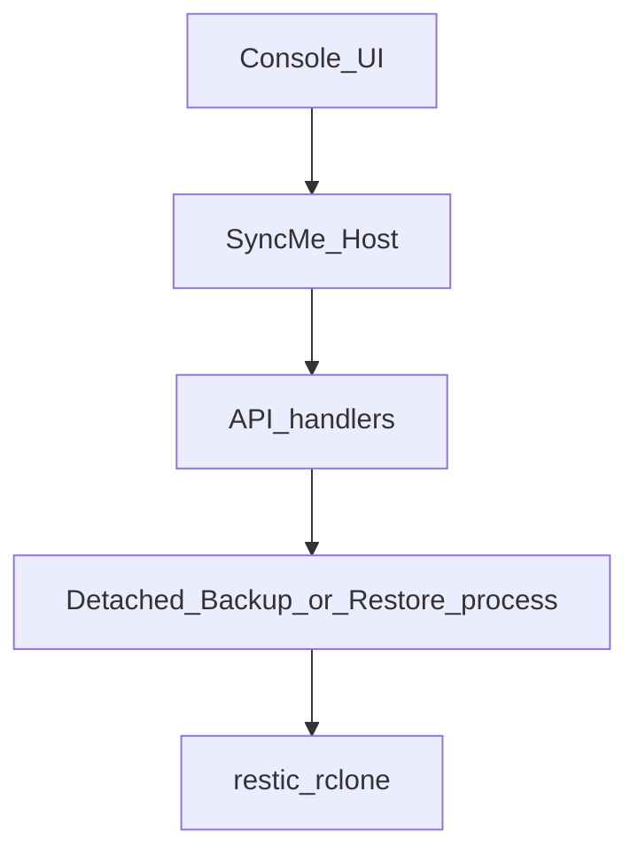
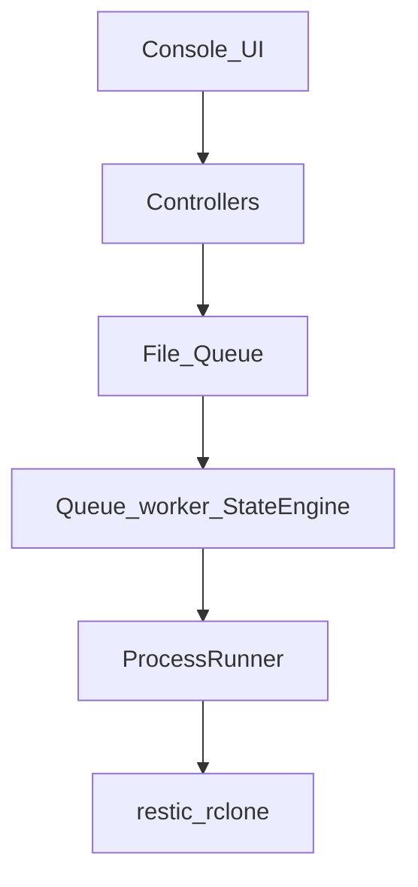

# SyncMe V2 — Architecture Direction

**Status:** Discussion draft. Not scheduled. Not a feature commitment.  
**Supported product today:** SyncMe **1.4.2** (see [`VERSION.txt`](VERSION.txt), [`TECHNICAL.md`](TECHNICAL.md)).

This document describes **direction** — how SyncMe should evolve — not a locked list of what any future release will contain. Product planning stays separate from implementation. Contents here may change across discussion rounds before any code is written.

Designed to be reliable on single-user PCs while scaling to managed fleets through modular orchestration, deterministic job execution, and native Windows integration.

---

## Core Design Principles

These are the project's constitution. New ideas should be tested against them.

| Principle | Meaning |
|---|---|
| Windows First | Primary platform is Windows Backup PCs (client and Server). |
| Zero Database | No SQL Server, SQLite, or embedded DB. State lives in files. |
| Zero IIS | No dependency on IIS or ASP.NET hosting. |
| PowerShell 5.1 Compatible | Remains the supported runtime on enterprise Windows. |
| Configuration over Code | Behavior changes via config and hooks, not forked product code. |
| File-Based State | Jobs, locks, logs, and telemetry are files operators can inspect. |
| No Persistent UI | Console is a static HTML client; the host owns process lifetime. |
| One Process, One Responsibility | Host, workers, and external tools stay separated by role. |
| Local First | Install and operate on the customer's machine / network. |
| Enterprise Optional | Managed-fleet capabilities are optional; core stays simple. |

---

## Architectural Non-Negotiables

The following are considered **permanent** unless explicitly deprecated in writing.

- No SQL Server
- No SQLite
- No PHP
- No IIS
- No Electron
- No .NET desktop GUI
- PowerShell 5.1 support remains mandatory
- Web UI remains static HTML / CSS / JS
- **Task Scheduler remains supported even after Windows Services are introduced**
- SyncMe Monitor remains an optional separate package (not merged into core by default)
- Customer payloads do not ship the marketing `website/` tree or tool installers

---

## Things We Will Never Build

Expectation management — stop asking; these are out of scope.

- Cloud-hosted SyncMe
- Multi-tenant SaaS
- Browser-only backup (no Backup PC agent/host)
- Linux support
- Docker edition
- Remote shell / remote command execution into Backup PCs
- Automatic cloud account creation
- Bare-metal imaging product
- Antivirus or ransomware "protection" product
- Replacing restic or rclone

---

## Capability roadmap

Version numbers are **labels when something ships**, not contracts for content.

```text
1.4.2 (Current Stable)
        |
        v
Foundation (labeled 2.0 when shipped)
        |
        v
Reliability (labeled 2.1 when shipped)
        |
        v
Future (under discussion)
```

### Current Stable — 1.4.2

What operators have today:

- Localhost Host (`SyncMe-Host.ps1`) + static console (`ui/`)
- Backup / restore / schedule / watchdog around restic (+ optional rclone)
- Multi-set `Config.ps1` + Credential Manager
- HTTPS in-app updates (`Modules/Update.ps1`) with SHA-256 and Config preserve
- Optional SyncMe Monitor add-on (separate package, heartbeats + test ping on Save)
- InstallMerge packaging for reliable upgrades
- ASCII-safe `.bat` / `.cmd` (no UTF-8 BOM)

### Foundation — labeled 2.0 when shipped

Capability targets (direction, not a frozen checklist):

- Modular layout: Host / Controllers / Engine / Modules
- File-based job queue + validated state machine
- Central ProcessRunner for restic / rclone
- Structured logging fields (see Logging philosophy)
- Configuration v2 (JSON + schema) via an explicit migration engine from Configuration v1 (`Config.ps1`)
- Behavior-compatible console APIs where practical

### Reliability — labeled 2.1 when shipped

Capability targets:

- Windows Service as an **additional** background execution model (Task Scheduler stays)
- Transactional self-update with health probe and rollback
- HookEngine drop-in folders with isolation contract
- ModuleHealth pre-run diagnostics probe
- Secrets evolution (DPAPI direction)
- Stronger OAuth refresh / probes
- Native restic VSS helpers where appropriate

### Future — under discussion

Examples only (may move, shrink, or vanish):

- Richer Monitor / multi-site ops without becoming SaaS
- rclone Sync/Bisync as a separate concern (not Foundation day-one)
- Further Rescue Kit / recovery automation

---

## Internal API contract

```text
Controllers  →  Engine  →  Modules  →  External Tools (restic / rclone)
```

### Controllers

- Receive HTTP
- Validate input
- Return JSON / static responses
- **Never** run restic or rclone
- **Never** perform business file work directly

### Engine

- Owns business logic and job lifecycle
- Coordinates modules
- Owns queue / state transitions
- Interprets outcomes for the UI

### Modules

- Low-level operations
- Prefer **stateless** and reusable
- Wrap OS / CLI / crypto / notify details
- Do not own cross-job orchestration

### External tools

- restic and rclone remain the engines of record for backup/cloud I/O
- Invoked only through ProcessRunner (target architecture)

---

## Target modular layout

North-star tree for a future modular SyncMe (names may evolve):

```text
SyncMe/
├── Host/           # HttpListener entry, Router, Request, Response
├── Engine/         # Queue, State, Backup, Restore, Scheduler, ProcessRunner,
│                   # OAuth, Update, Hooks
├── Controllers/    # Backup, Restore, System, OAuth
├── Modules/        # Restic, Rclone, VSS, Secrets, Logger, Health, Notify
├── Config/         # Config.json, Sets.json, rclone.conf
├── Data/           # Queue/, Locks/, Logs/, Reports/, Cache/
├── Hooks/          # PreBackup, PostBackup, PreRestore, PostRestore
├── Service/        # Optional WinSW/NSSM wrapper (Reliability axis)
├── RescueKit/      # Emergency recovery helpers
└── UI/             # Static console (:17845)
```

**Mapping from 1.4.2 (illustrative):**

| Today (1.4.2) | Direction |
|---|---|
| `SyncMe-Host.ps1` (+ inline routes) | Host + Controllers |
| `SyncMe-Backup.ps1` / `SyncMe-Restore.ps1` | BackupEngine / RestoreEngine + queue |
| `Modules/Update.ps1` | UpdateEngine (transactional + rollback on Reliability) |
| `Modules/MonitorClient.ps1` | Stays client-side; Monitor product remains separate |
| `Modules/InstallMerge.ps1` | Part of update/install pipeline |
| `Config.ps1` | Configuration v1 → migrate to Config.json / Sets.json |
| `Register-BackupTask.ps1` | Scheduler bridge; Task Scheduler never removed |
| Pre/post hooks (set config today) | HookEngine folders + isolation contract |

---

## Queue lifecycle

Happy path:

```text
Created → Validated → Queued → Preparing → Running → Verifying → Completed → Archived
```

Edge / recovery states:

| State | Meaning |
|---|---|
| Retry | Transient failure; attempt again under MaxRetries |
| Cancelled | Operator or API requested stop |
| Abandoned | Worker lost; not safely resumable |
| Expired | Job exceeded allowed age / TTL |
| Interrupted | Process died mid-flight (e.g. power loss); needs recovery decision |
| Failed | Terminal failure after policy |

Every queue item and config document should carry a `"Schema"` field (e.g. `"2.1"` when that contract exists) so readers and migrators can evolve safely.

Example job shape (illustrative):

```json
{
  "Schema": "2.1",
  "JobId": "job_20260804_0012",
  "SetId": "Office_Servers",
  "Type": "Backup",
  "Priority": "Normal",
  "State": "Queued",
  "Created": "2026-08-04T20:34:00Z",
  "Attempts": 0,
  "MaxRetries": 3,
  "Params": {
    "DryRun": false,
    "ForceVSS": true,
    "Compression": "Balanced"
  }
}
```

---

## Recovery strategy

Power-loss / crash story (target):

```text
Power failure
  → Restart
  → Queue scan
  → Recover orphan jobs
  → Verify lock files
  → Resume or mark failed
```

Operators should always be able to inspect `Data/Queue/` and `Data/Locks/` as files. Recovery must prefer **safe failure** over silent corruption of repositories or config.

---

## Logging philosophy

Every structured log event should carry:

| Field | Role |
|---|---|
| Timestamp | When |
| Severity | Level |
| Source | Host machine / install identity |
| Component | Controller / Engine / Module / tool |
| Job ID | Queue correlation |
| Message | Human-readable |
| Duration | Where applicable |
| Exit Code | External tool or stage result |

UI progress telemetry (e.g. latest progress JSON) remains separate from the durable audit log, but should stay correlatable by Job ID.

---

## Configuration evolution

```text
Configuration v1 (Config.ps1 era)
        → Migration Engine
        → Configuration v2 (JSON + schema)
        → Schema Validation
        → Auto Upgrade
```

Rules:

- Unknown fields are **ignored** (forward compatible readers)
- Older configs are **migrated**
- Config is **never silently discarded**
- Operators keep an obvious backup before destructive upgrades

---

## Performance targets

Aspirational until measured on reference hardware. Goals for the orchestration layer (excluding restic/rclone work itself):

| Metric | Target |
|---|---|
| Host startup | under 2 seconds |
| Idle RAM | under 30 MB |
| Static UI payload | under 15 MB |
| HTTP response (simple JSON) | under 100 ms |
| Queue polling interval | ~250 ms |
| Backup orchestration overhead | under 2% |

---

## Hook / plugin stability contract

Hooks are isolated drop-ins (target: `Hooks/PreBackup`, `PostBackup`, `PreRestore`, `PostRestore`).

- Failure of a hook **must not** abort SyncMe **unless** `StopOnHookFailure=true`.
- Outcomes are logged to the job audit trail.
- Hooks must be non-interactive for scheduled runs.

---

## Background execution models

Background execution will support:

- **Windows Task Scheduler** — existing; remains supported
- **Windows Service** — planned on the Reliability axis as an **additional** model

Service is **not** a Foundation-day promise and is **not** a forced migration. Task Scheduler is resilient and often easier to troubleshoot in enterprise environments; positioning Service as additive preserves compatibility.

---

## Reliability-axis capabilities (when labeled 2.1)

Capability targets — not a frozen ship list:

- Transactional update with health probe and auto-rollback
- HookEngine folders + isolation contract (above)
- ModuleHealth pre-run diagnostics probe
- Secrets evolution (DPAPI direction)
- Stronger OAuth refresh / validity probes
- Native restic VSS helpers where appropriate
- Optional Windows Service wrapper (WinSW/NSSM)

---

## Current vs queue-worker model

### Today (1.4.2)



API threads may start work fairly directly (detached processes). Progress is file-based (`live-progress.json`). Scheduler invokes backup without the host.

### Direction (Foundation+)



Controllers enqueue validated jobs; a worker owns state transitions; ProcessRunner is the only door to external tools.

---

## Decision log

| ID | Decision | Reason |
|---|---|---|
| D001 | PowerShell 5.1 remains mandatory | Enterprise Windows compatibility without extra runtimes |
| D002 | No database | Lower maintenance, simpler recovery, portable installs |
| D003 | JSON / file queues (direction) | Crash recovery, human-readable, easy debugging |
| D004 | Task Scheduler stays forever | Resilient and easy to troubleshoot; Service is additive only |
| D005 | Monitor stays a separate package | Keeps core Backup PC install small; fleet view is optional |
| D006 | Static HTML UI | No Electron/.NET GUI; localhost console stays simple |

Add new rows when decisions stick. Do not reopen settled rows without an explicit deprecation note.

---

## Open questions

Seeded for future discussion rounds (answers not required to publish this draft):

1. How aggressive should Configuration v1 → v2 migration be on first Foundation install (auto vs guided)?
2. Should queue storage live under install `Data/` only, or allow a configurable data root on another volume?
3. Which `/api/*` routes must stay byte-compatible vs may version via headers/schema?
4. How far should Monitor V2 share Engine patterns without merging packages?
5. What is the minimum ModuleHealth gate before a scheduled backup may start?

---

## How to use this document

- Treat changes as **proposals** until recorded in the Decision Log.
- Prefer editing capability buckets over promising dates.
- Keep 1.4.2 behavior stable while this draft evolves.
- Public summary: [Roadmap on www.syncme.co.za](https://www.syncme.co.za/roadmap.html) (upload with the marketing site).
