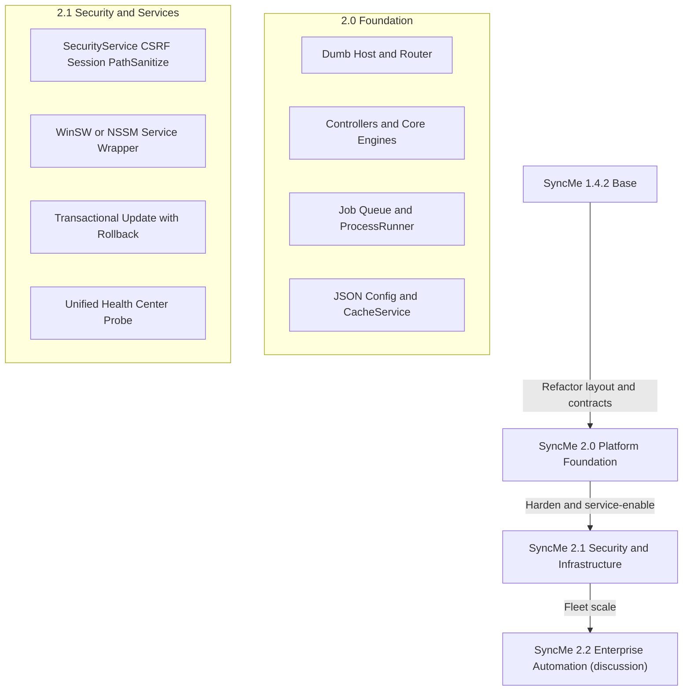

# SYNCME V2 ARCHITECTURE BLUEPRINT & CURSOR SPECIFICATION

> **Status:** Production Development Specification (planning stage; implementation not started)  
> **Target Release Line:** SyncMe 2.0 (Foundation) -> SyncMe 2.1 (Hardening)  
> **Supported Legacy Release:** SyncMe 1.4.2 (Maintenance Mode)  
> **Target Runtime:** Windows PowerShell 5.1+ (Desktop Edition), pure ASCII batch, static HTML5/JS  
> **Design Philosophy:** Windows-native, Zero-DB, Zero-IIS/PHP, Dumb Host, strict security boundaries

This document is the technical blueprint for the SyncMe 2.x line. It defines architectural direction and contracts for implementation work when development begins.

---

## 1) Core Design Principles

| Principle | Meaning |
|---|---|
| Windows First | Primary platform is Windows Backup PCs (client and Server). |
| Zero Database | No SQL Server, SQLite, or embedded DB. State stays file-based. |
| Zero IIS | No dependency on IIS/PHP web stacks. |
| PowerShell 5.1 Compatible | Mandatory runtime baseline for enterprise Windows installs. |
| Configuration over Code | Behavior should be changed by config and hooks first. |
| File-Based State | Queue, locks, reports, and logs are inspectable files. |
| No Persistent UI | Static HTML/CSS/JS client, host-owned process model. |
| One Process, One Responsibility | Host/router, engines, and tool execution remain separated. |
| Local First | Runs on customer-managed infrastructure. |
| Enterprise Optional | Fleet-scale capabilities are additive, not required for core usage. |

---

## 2) Architectural Non-Negotiables

The following are permanent unless explicitly deprecated:

- No SQL Server
- No SQLite
- No PHP
- No IIS
- No Electron
- No .NET desktop GUI
- PowerShell 5.1 support remains mandatory
- Web UI remains static HTML/CSS/JS
- Task Scheduler remains supported even after services are introduced
- SyncMe Monitor is **not** absorbed into the SyncMe core host (keeps the backup install lean). The **fleet dashboard target migrates to LocalOps Console**; SyncMe keeps thin heartbeat/register clients only. Migration: [docs/LOCALOPS_INTEGRATION.md](docs/LOCALOPS_INTEGRATION.md)
- Customer payloads do not ship `website/` or bundled third-party installer binaries

---

## 3) Things We Will Never Build

- Cloud-hosted SyncMe
- Multi-tenant SaaS
- Browser-only backup (without a Backup PC host)
- Linux support
- Docker edition
- Remote shell into Backup PCs
- Automatic cloud account creation
- Bare-metal imaging product
- Antivirus/ransomware protection product
- A replacement for restic/rclone

---

## 4) Architectural Map & Versioning Phases

Version numbers are labels when shipped. Capability grouping is the primary planning axis.



### 4.1 Current Stable (1.4.2)

- Host + UI + `/api/*` in `SyncMe-Host.ps1`
- Detached backup/restore execution
- Multi-set `Config.ps1` model
- HTTPS update check/install with SHA-256 verify
- Optional Monitor heartbeat client (fleet UI migrating to LocalOps — docs/LOCALOPS_INTEGRATION.md)
- Optional LocalOps Console loopback registration (SyncMe tab)

### 4.2 Foundation (2.0 target)

- Dumb Host pattern
- Router + controllers split
- File queue + state machine
- ProcessRunner as the only external-tool execution path
- JSON config model + cache layer

### 4.3 Hardening (2.1 target)

- Security service boundary (CSRF/session/path sanitization)
- Optional Windows service wrapper (additive model)
- Transactional updater with rollback
- Unified health center probe

### 4.4 Future (2.2 discussion)

- Fleet-scale automation capabilities, only after 2.0/2.1 contracts are stable

---

## 5) 2.0 Foundation: Modular Platform Contracts

### 5.1 Dumb Host Pattern

`Host.ps1` only:

- binds `HttpListener`
- handles startup/shutdown loop
- delegates request handling

It does not own business logic.

### 5.2 Routing & Controllers

`Router.ps1` dispatches path + method to controllers. Controllers:

- parse and validate input
- call services/engines
- return standardized JSON/HTML through `Response.ps1`

Controllers never run restic/rclone directly and never own queue worker loops.

### 5.3 Job Queue

All long-running operations become queue jobs written atomically under `Data/Queue/`. HTTP workers enqueue and return immediately.

### 5.4 Process Supervisor

`ProcessRunner.ps1` is the only component that spawns `restic.exe`/`rclone.exe`.

### 5.5 Configuration & Caching

- `Config.ps1` (v1) evolves into `Config/Config.json` + `Config/Sets.json` (v2)
- `CacheService.ps1` reduces repetitive tool calls on dashboard refreshes

---

## 6) 2.1 Hardening: Security, Infrastructure, Services

### 6.1 Security Subsystem

`SecurityService.ps1` enforces:

- session token model
- CSRF validation on mutating requests
- strict path normalization and traversal blocking
- input sanitization contract
- DPAPI-based secret handling wrappers

### 6.2 Service Runtime (Additive)

Windows Service wrapper via `Install-SyncMeService.ps1` (WinSW/NSSM) is additive. Task Scheduler remains supported and first-class.

### 6.3 Transactional Self-Updater

`UpdateEngine.ps1` flow:

1. Download + hash verify
2. Stage unpack
3. Backup current install
4. Acquire update lock
5. Swap preserving config/data
6. Restart + health probe
7. Auto-rollback on failed probe

### 6.4 Unified Diagnostics

`HealthService.ps1` evaluates disk, VSS, network, scheduler/service state, credential readiness, and related readiness checks before risky operations.

---

## 7) Directory Structure & Component Roles

```text
SyncMe/
├── Host/
│   ├── Host.ps1                  # Minimal HttpListener loop & lifecycle
│   ├── Router.ps1                # Path dispatcher & middleware pipeline
│   ├── Request.ps1               # Request parser and sanitization helper
│   └── Response.ps1              # Standard JSON/HTML formatter
├── Controllers/
│   ├── DashboardController.ps1   # GET /api/dashboard telemetry
│   ├── BackupController.ps1      # /api/backup/run, /api/backup/queue
│   ├── RestoreController.ps1     # /api/restore/browse, /api/restore/exec
│   ├── SettingsController.ps1    # /api/settings
│   ├── OAuthController.ps1       # /api/oauth/*
│   └── UpdateController.ps1      # /api/update/*
├── Engine/
│   ├── QueueEngine.ps1           # Queue worker and scheduling
│   ├── StateEngine.ps1           # State transitions and invariants
│   ├── BackupEngine.ps1          # Stage orchestration for backup flow
│   ├── RestoreEngine.ps1         # Snapshot browse and extraction orchestration
│   ├── ProcessRunner.ps1         # External process supervision
│   ├── SchedulerEngine.ps1       # Task Scheduler bridge
│   └── UpdateEngine.ps1          # Transactional updater + rollback
├── Services/
│   ├── SecurityService.ps1       # Session/CSRF/path hardening
│   ├── CacheService.ps1          # 30-60s status cache
│   ├── ConfigService.ps1         # JSON config + migration logic
│   └── HealthService.ps1         # Unified diagnostics
├── Modules/
│   ├── ModuleRestic.ps1          # Restic args and JSON parser
│   ├── ModuleRclone.ps1          # Rclone orchestration helpers
│   ├── ModuleVSS.ps1             # VSS integration helper
│   ├── ModuleSecrets.ps1         # DPAPI wrappers
│   ├── ModuleLogger.ps1          # Structured logging
│   ├── ModuleNotify.ps1          # Email/toast/webhook
│   └── ModuleReport.ps1          # HTML reports + cleanup
├── Config/
│   ├── Config.json               # App options + schema version
│   ├── Sets.json                 # Backup sets & rules
│   └── rclone.conf               # Managed remote config
├── Data/
│   ├── Queue/                    # Pending/active/completed jobs
│   ├── Locks/                    # Backup.lock, Update.lock
│   ├── Logs/                     # Daily logs + security audit logs
│   ├── Reports/                  # HTML reports + telemetry JSON
│   └── Cache/                    # Metadata/status caches
├── Hooks/
│   ├── PreBackup/
│   ├── PostBackup/
│   ├── PreRestore/
│   └── PostRestore/
├── Service/
│   ├── Install-SyncMeService.ps1 # Service installer/remover
│   └── win-service.xml           # Service wrapper manifest
├── RescueKit/                    # Emergency recovery scripts
├── Tools/                        # restic.exe, rclone.exe, winsw.exe
└── UI/                           # Static HTML/CSS/JS console
```

---

## 8) Architectural Contracts & Data Flows

### 8.1 Request Execution Pipeline

```text
HTTP Request
  -> Host.ps1
  -> Router.ps1 (sanitize path, validate session/CSRF)
  -> Controller
  -> QueueEngine/Engine
  -> ProcessRunner
  -> restic/rclone
  -> Response.ps1
```

### 8.2 Internal Layer Contract

```text
Controllers -> Engine -> Modules -> External Tools
```

- **Controllers:** HTTP contract + validation + response mapping
- **Engine:** workflow and orchestration decisions
- **Modules:** low-level reusable operations
- **External tools:** never invoked outside ProcessRunner

---

## 9) Job Queue Specification

Queue files are atomic JSON documents in `Data/Queue/`.

Example:

```json
{
  "SchemaVersion": "2.0",
  "JobId": "job_20260806_0001",
  "SetId": "Office_Data",
  "Type": "Backup",
  "Priority": "Normal",
  "State": "Queued",
  "Created": "2026-08-06T09:00:00Z",
  "Attempts": 0,
  "MaxRetries": 3,
  "Parameters": {
    "DryRun": false,
    "ForceVSS": true,
    "Compression": "Balanced"
  }
}
```

### 9.1 Lifecycle

```text
Created -> Validated -> Queued -> Preparing -> Snapshot -> Scanning -> Uploading -> Verifying -> Pruning -> Finished -> Archived
```

Edge states:

- Retry
- Cancelled
- Abandoned
- Expired
- Interrupted
- Failed

---

## 10) Recovery Strategy

```text
Power failure
  -> Restart
  -> Queue scan
  -> Recover orphan jobs
  -> Verify lock files
  -> Resume or mark failed
```

Recovery is file-observable (`Data/Queue`, `Data/Locks`) and prefers safe failure over hidden corruption.

---

## 11) Cross-Cutting Services & Security

### 11.1 SecurityService Contract

Responsibilities:

- Path normalization + anti-traversal checks
- Session token generation
- CSRF enforcement (`X-SyncMe-CSRF` for mutating methods)
- Input sanitization
- DPAPI wrappers for secrets

Illustrative path guard:

```powershell
function Assert-SafePath {
    param([string]$Path)
    $normalized = [System.IO.Path]::GetFullPath($Path)
    if ($normalized.Contains("..") -or -not ($normalized.StartsWith("C:\") -or $normalized.StartsWith("\\"))) {
        throw "Access Denied: Invalid or malicious path structure."
    }
    return $normalized
}
```

### 11.2 CacheService Contract

- cache keys under `Data/Cache/<key>.json`
- TTL default 30-60s for dashboard/status lookups
- instant invalidation when backup/prune/update completes

---

## 12) ProcessRunner Specification

All `restic`/`rclone` execution must route through `Engine/ProcessRunner.ps1`.

Mandatory capabilities:

- real-time stdout/stderr stream capture
- restic `--json` parse to UI telemetry (latest status JSON)
- graceful cancellation attempt (CTRL_BREAK) before forced kill
- stall timeout protection (default 30 minutes without I/O)
- normalized exit code/result contract for engines/controllers

---

## 13) Logging Philosophy

Every structured event should include:

- Timestamp
- Severity
- Source
- Component
- JobId
- Message
- Duration
- ExitCode

UI status telemetry may be separate but must correlate by JobId.

---

## 14) Configuration Evolution Contract

```text
Configuration v1 (Config.ps1)
  -> Migration Engine
  -> Configuration v2 (Config.json + Sets.json)
  -> Schema Validation
  -> Auto Upgrade
```

Rules:

- unknown fields are ignored
- older configs are migrated
- values are never silently discarded
- pre-migration backup is mandatory

---

## 15) Performance Targets (Engineering Goals)

| Metric | Target |
|---|---|
| Host startup | < 2 seconds |
| Idle RAM | < 30 MB |
| Static UI payload | < 15 MB |
| Simple HTTP response | < 100 ms |
| Queue polling | 250 ms |
| Orchestration overhead | < 2% |

---

## 16) Hook Stability Contract

Hooks are isolated (`Hooks/PreBackup`, `PostBackup`, `PreRestore`, `PostRestore`).

- Hook failure does **not** abort SyncMe by default
- Only abort when `StopOnHookFailure=true`
- Hook outcomes are always logged
- Hooks must be non-interactive for scheduled/background execution

---

## 17) Coding Constraints for Cursor Generation

- Must run on **PowerShell 5.1** (Desktop Edition)
- Do not use PowerShell 7-only syntax (`?:`, `&&` chains)
- `.bat` files: pure ASCII, no BOM
- `.ps1` files: UTF-8 without BOM
- UI remains static Vanilla HTML/CSS/JS (no Node build pipeline)
- Host loop must not block on long external process or heavy file I/O

---

## 18) Decision Log (ADR-style)

| ID | Decision | Reason |
|---|---|---|
| D001 | PowerShell 5.1 remains mandatory | Enterprise Windows compatibility |
| D002 | No database | Lower maintenance, simpler recovery, portability |
| D003 | JSON/file queue architecture | Crash recovery + inspectability |
| D004 | Task Scheduler stays supported | Operational resilience and easy troubleshooting |
| D005 | Fleet dashboard lives outside SyncMe core (LocalOps target; Monitor package until cutover) | Keep core install lean; optional fleet UI — see docs/LOCALOPS_INTEGRATION.md |
| D006 | Single SyncMe 2.x line (no V3 split) | Preserve release momentum and migration clarity |
| D007 | Dumb Host + controller split | Clear boundaries and reduced coupling |
| D008 | Controllers never run restic/rclone directly | Security and orchestration consistency |
| D009 | Service mode is additive in 2.1 | Compatibility with existing Task Scheduler estates |

---

## 19) Open Questions

1. Should config migration run fully automatic on first 2.0 startup, or require a one-time confirmation gate?
2. Should queue/log/cache roots be movable to a custom data volume?
3. Which 1.4.2 API routes must be byte-compatible versus versioned?
4. What minimum health-gate failures should block scheduled backup start?
5. How should SyncMe dual-write during LocalOps Monitor absorption (single MonitorUrl pointing at LocalOps vs temporary second endpoint)? See docs/LOCALOPS_INTEGRATION.md.

---

## 20) Suggested Implementation Order (when coding begins)

1. `Services/SecurityService.ps1`
2. `Engine/ProcessRunner.ps1`
3. `Host/Router.ps1`

This document defines the architecture and contracts. It does not itself authorize implementation work.
